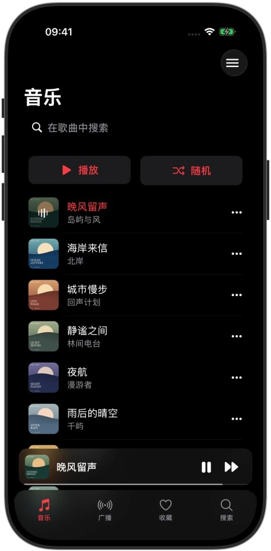
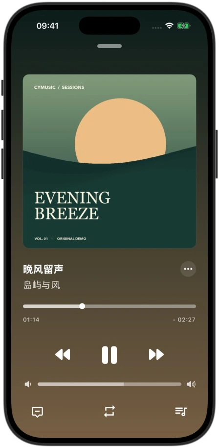
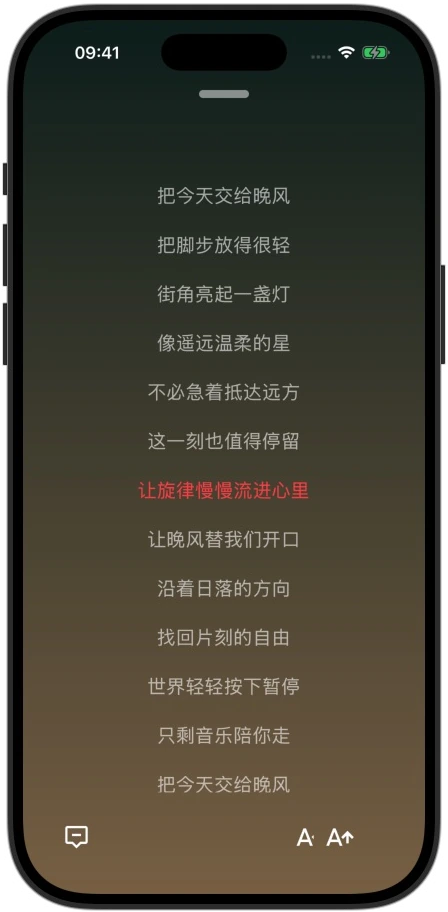
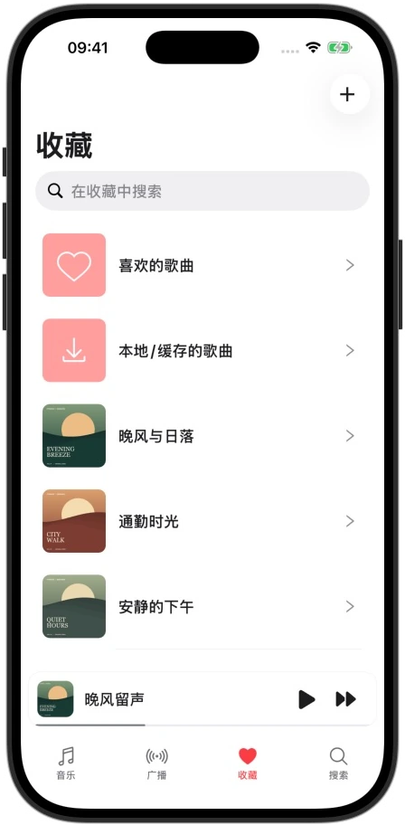
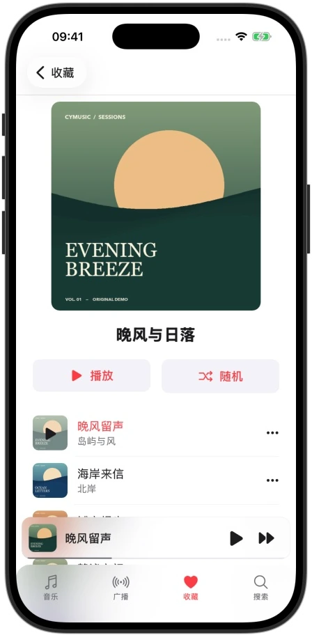
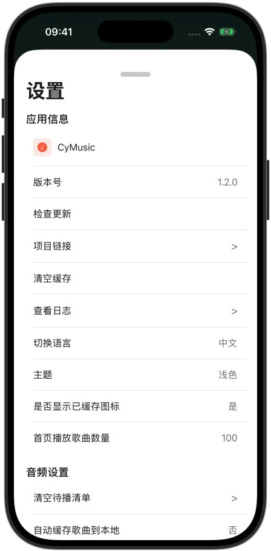

<p align="center">
  
</p>

<h1 align="center">CyMusic</h1>

<p align="center">
  一款支持自定义音源、滚动歌词与本地音乐的 iOS 播放器。
</p>

<p align="center">
  <a href="https://github.com/gyc-12/Cymusic/actions/workflows/build-ios.yml"></a>
  
  
  
  <a href="LICENSE"></a>
</p>

<p align="center">
  <a href="#下载">下载</a> ·
  <a href="#应用预览">应用预览</a> ·
  <a href="#开始使用">开始使用</a> ·
  <a href="#开发指南">开发指南</a> ·
  <a href="https://github.com/gyc-12/Cymusic/issues">反馈问题</a>
</p>

CyMusic 将音乐浏览、播放、歌词和个人歌单放在一起，支持深色、浅色与跟随系统的外观。
当前 `main` 基于 **Expo 57、React Native 新架构和 RNTP v5**，保留原有 App 的主要功能。

> [!NOTE]
> **官方 App 永久免费，仅限个人非商业使用，禁止商业用途。**
> App 不内置音频播放源；在线播放需要自行导入音源。RNTP v5 适用独立许可证，详见[许可与使用范围](#许可与使用范围)。

## 应用预览

<table>
  <tr>
    <td align="center" width="33%"><br /><sub>音乐列表</sub></td>
    <td align="center" width="33%"><br /><sub>正在播放</sub></td>
    <td align="center" width="33%"><br /><sub>滚动歌词</sub></td>
  </tr>
  <tr>
    <td align="center"><br /><sub>个人收藏</sub></td>
    <td align="center"><br /><sub>歌单管理</sub></td>
    <td align="center"><br /><sub>按喜好设置</sub></td>
  </tr>
</table>

截图采自当前 iOS 构建（iPhone 17 Pro · iOS 26.5），使用演示歌单、封面与歌词。演示内容不随 App 分发，也不代表 App 内置音源。

## 功能

| | 你可以做什么 |
| --- | --- |
| **浏览与搜索** | 浏览歌曲和榜单，搜索歌曲、歌手，查看专辑与歌手页面。 |
| **播放与队列** | 管理待播清单，切换播放模式，调节播放进度和系统音量，设置定时关闭。 |
| **歌词** | 查看滚动歌词、调整字号与时间偏移，在歌词页面保持屏幕常亮。 |
| **收藏与歌单** | 收藏歌曲，创建自定义歌单，导入 QQ 音乐歌单，添加或移除歌单内歌曲。 |
| **本地与缓存** | 播放本地音乐，下载或自动缓存歌曲，查看缓存标记并管理本地歌曲。 |
| **自定义音源** | 从文件或 URL 导入脚本，切换、更新和测试音源；通过系统分享接收脚本文件、链接或文本。 |
| **外观与语言** | 深色、浅色、跟随系统；中文与英文界面。 |

在线内容、可用音质与播放结果取决于第三方平台和所配置的音源。

部分 FLAC 在快进后可能出现音频与歌词不同步，可在 **设置 → 音频设置 → 精确跳转**
中开启改善。该开关默认关闭，记住选择并在切换歌曲后生效；开启后部分音频可能需要
完整加载，播放前等待更久。

## 下载

支持 **iOS 16.4 及以上**。

| 渠道 | 用途 |
| --- | --- |
| [GitHub Releases](https://github.com/gyc-12/Cymusic/releases) | 获取已发布版本与对应说明。 |
| [main 分支构建](https://github.com/gyc-12/Cymusic/actions/workflows/build-ios.yml?query=branch%3Amain) | 获取当前源码的 IPA；打开最近一次成功运行，在 **Artifacts** 下载 `CyMusic-unsigned-ipa`。 |

本 README 介绍 `main` 分支。Releases 与 `main` 可能处于不同版本；如需 Expo 57 / RNTP v5 版本，请选择对应的 `main` 构建。
Actions 产物是**未签名 IPA**，安装到真机前需要自己的有效签名和 App Group 配置。

## 开始使用

1. **安装 App**：从上方渠道获取对应版本，完成签名后安装。
2. **配置音源**：进入设置 → 自定义音源 → 导入音源，选择本地脚本或输入脚本 URL。可参考 [CyMusic 音源示例](https://github.com/gyc-12/CyMusic-ImportMusicApi-Example)。
3. **整理音乐**：在“收藏”中管理喜欢的歌曲、自定义歌单及本地/缓存歌曲；创建歌单或导入 QQ 音乐歌单。
4. **开始播放**：选择歌曲，点击底部迷你播放器展开播放页；在歌曲菜单中打开歌词、收藏、添加到歌单或设置定时关闭。

首次导入的音源会自动选中。请使用可信且有权访问的音源，并尊重音乐作品的版权。

## 开发指南

当前使用的工具链：**Node 24.19.0 · Yarn 1.22.22 · CocoaPods 1.16.2 · Xcode 26.6**。

```bash
git clone https://github.com/gyc-12/Cymusic.git
cd Cymusic

yarn install --frozen-lockfile --non-interactive
cd ios
pod _1.16.2_ install --deployment
cd ..

npx expo run:ios --no-install
```

自定义原生模块需要开发构建，不能在 Expo Go 中运行。仓库维护原有 `ios/` 工程与分享扩展，**不要运行 `expo prebuild` 覆盖原生工程**。
请保留锁文件和安装时应用的补丁；原生依赖或补丁变更后需要重新构建 App。

| 核心组件 | 当前版本 / 方案 |
| --- | --- |
| 框架 | Expo **57.0.21** · React Native **0.86.3** · React **19.2.3** |
| 原生架构 | New Architecture · Fabric · Hermes |
| 播放器 | `@rntp/player` **5.9.2**，适用独立许可 |
| 路由与状态 | Expo Router · Zustand |
| 存储 | MMKV 4 / Nitro · AsyncStorage |
| 本地能力 | Expo FileSystem 与自有 Expo Modules：音源运行时、系统音量、定时服务等 |

- [完整开发指南](docs/development.md)：环境准备、原生补丁、Pods 配置恢复、Release 构建与专项检查。
- [RNTP v5 集成记录](docs/maintenance/2026-09-10-rntp-v5.md)：实现边界、验证结果与回退说明。
- [精确跳转验证](docs/maintenance/2026-09-10-precise-seeking.md)：FLAC 跳转修复、加载取舍和复现方法。
- [第三方许可说明](third-party-licenses/README.md)：播放器许可的版本、来源与适用范围。

## 参与贡献

欢迎通过 [Issues](https://github.com/gyc-12/Cymusic/issues) 报告问题或提出建议，反馈时请附 App 版本、设备系统和复现步骤。
提交 PR 时请说明改动目的、影响范围与验证结果；涉及原生依赖时同步检查锁文件、补丁和 iOS 构建。
当前构建方式、专项检查和已知验证边界见[开发指南](docs/development.md)。

项目动态：[Telegram 频道](https://t.me/gyc_123)。

## 许可与使用范围

- **自有源码**：按 [Apache License 2.0](LICENSE) 授权。官方 App 的使用说明不修改 Apache-2.0 条款，也不撤销已有的源码授权。
- **RNTP v5**：`@rntp/player@5.9.2` 的版权属于 Double Symmetry GmbH，适用随该版本发布的[独立许可证](third-party-licenses/rntp-player-5.9.2.txt)。**RNTP v5 不属于 CyMusic 的 Apache-2.0 授权范围**，不能因本项目开源而视其为 Apache-2.0 或 MIT 软件；CyMusic 不另行授予其商业使用或再许可权利。
- **官方 App**：永久免费，仅限个人、非职业、非商业使用，禁止商业用途。免费不等于可以用于公司、组织或商业产品，RNTP 的具体授权条件以其原文为准。
- **其他依赖**：保留各自的版权与许可证。

完整说明见 [CyMusic 官方 App 使用说明](docs/app-usage.md)。请尊重版权，支持正版音乐。

## 致谢

感谢这些项目提供的参考与启发：

- [CodeWithGionatha-Labs/music-player](https://github.com/CodeWithGionatha-Labs/music-player)
- [lyswhut/lx-music-mobile](https://github.com/lyswhut/lx-music-mobile)
- [maotoumao/MusicFree](https://github.com/maotoumao/MusicFree)

<details>
  <summary>Star History</summary>

[](https://www.star-history.com/#gyc-12/Cymusic&Date)

</details>
